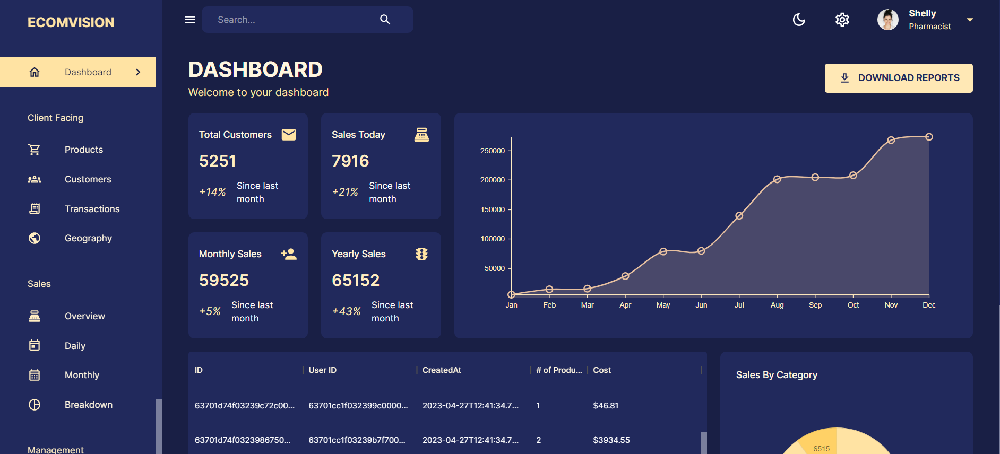
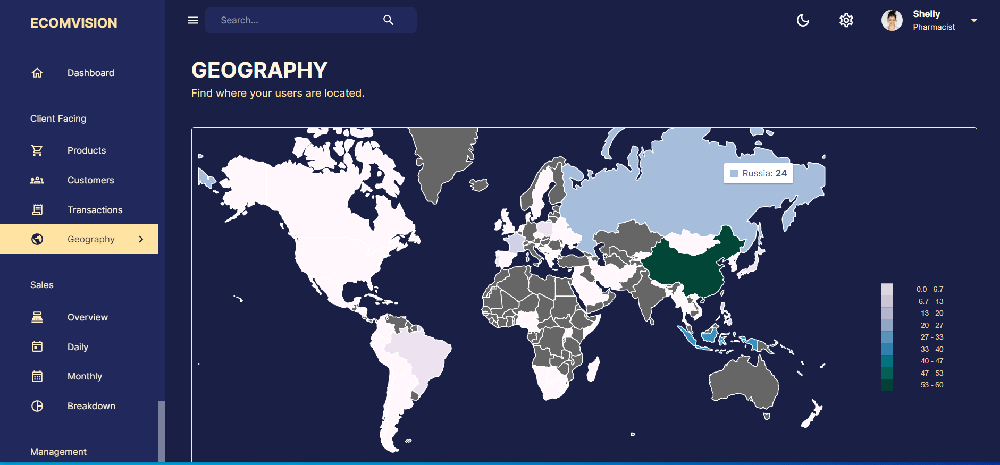

# MERN Admin Dashboard

This MERN Stack Admin Dashboard provides a comprehensive solution for managing and visualizing data in an intuitive and efficient manner. The frontend of the dashboard utilizes Material UI, Material UI Data Grid, Nivo Charts, Redux Toolkit, and Redux Toolkit Query, ensuring a visually appealing and responsive user interface.

For the backend, I leverage the power of Node.js and Express.js to handle server-side operations, while Mongoose serves as the ODM (Object-Document Mapping) tool for interacting with the MongoDB database. This allows for seamless data storage and retrieval.

The application also demonstrates effective data modeling using Entity Relationship Diagrams (ERDs), ensuring proper structuring of data and relationships between entities. Furthermore, the integration of MongoDB enables the execution of aggregate calls, facilitating advanced data analysis and reporting.

This MERN Stack Admin Dashboard empowers administrators to efficiently manage data, visualize insights using charts, and perform aggregate queries for in-depth analysis. With its utilization of modern web technologies and effective data modeling, the dashboard offers a powerful tool for data management and visualization.

## Views

  

  

## Setup

- Clone the project: `git@github.com:rOluochKe/MERN-Admin-Dashboard.git`
- Change directory into both client and server directories separately: `cd /client && cd /server`
- Install the required dependencies for both client and server: `npm install`
- Setup mongodb database and add url to `.env` file configuration and insert data into the database in file `server/index.js`
- Run both the applications simultaneously: client `npm run dev` and server `npm run dev`
- View the application on the browser using `http://localhost:5173`

